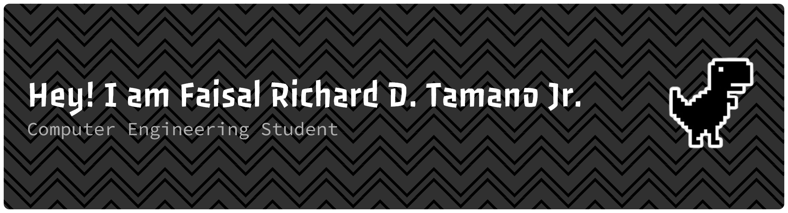

##

I am a Computer Engineering student at De La Salle University Manila. I am strongly driven by my curiosity to explore novel ideas and also understand the underlying processes behind different technologies. I enjoy cooperating with others, discussing potential solutions to challenging problems, and asking questions which rectify the gaps in my knowledge.

  
  

<i>Icons by <a href="https://www.freepik.com">Freepik</a></i>

## 📒 About Me

- 👦 Pronouns: He/Him
- 🔭 I’m currently pursuing my Bachelor of Science Degree in **Computer Engineering** at **De La Salle University Manila**
- ❤️ I love **C**, **Python**, and software development in general. I aim to be very proficient in **Microcontrollers**, **Microprocessors**, **C++**, and also Web & Mobile Application development within the next 5 years.
- ⚡ Fun fact: I try to share my thought process (like how I plan my papers) and research/readings online through my [website](https://faisals-notebook.pages.dev/) (when both possible and feasible). Besides wanting to be an efficient learner, I also want to be an effective communicator.

## 🔨 Tools I Have Used and Learned 

### 🔠 Languages and Frameworks

### 🧑‍💻 Applications and Platforms

## 📊My GitHub Statistics

